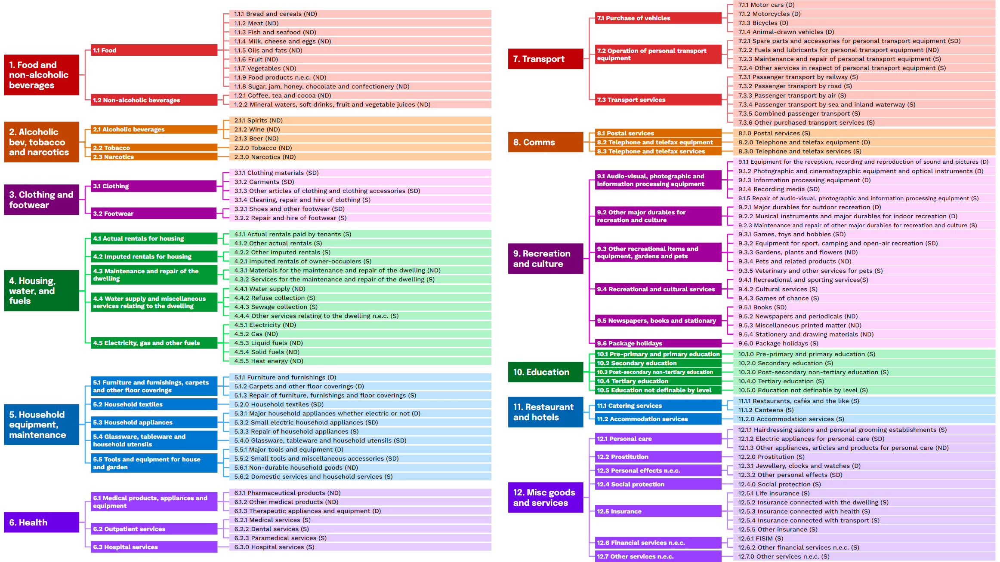

# COICOP Labeller
This algorithm will categorize a set of product names into the UN 2018 standard for [Classification of Individual Consumption According to Purpose (COICOP)](https://unstats.un.org/unsd/classifications/Econ/Download/COICOP_2018_draft_publication.pdf). This algorithm can be used for a variety of purposes incluing ingesting country household expenditure surveys, company production line documents, and more. 

[World Data Pro](worlddata.pro) uses COICOP Labeller to ingest survey data from over 40 countries to forecast key economic indicators. See [here](worlddata.pro) if World Data Pro fits your enterprise needs. This code is published by [World Data Lab](worlddata.io) (WDL). 

## Description
The algorithm uses the [Open AI API](https://platform.openai.com/docs/overview) to categorize a set of product names into the COICOP labelling standard. For WDL, large generalized language models have proven to have better accuracies than existing categorization methods such as Support Vector Machines or Random Forests. 

The algorithm takes a set of product names in .csv format. The algorithm labels these products by sending the products in chunks to the Open AI API and ingests the output into a .csv format. The default chunk size is 500. 

### About COICOP
COICOP is a UN hierarchical standard for labelling individual consumption products (i.e. flour, shoes, mortgages). Agencies and companies use COICOP to standardize their household product consumption data into categories. 
COICOP uses a hierarchical system of categorization. There are 3 levels of categorization (see [documentation](https://unstats.un.org/unsd/classifications/Econ/Download/COICOP_2018_draft_publication.pdf)). Each COICOP label is in the form X.X.X, where each X represents a label. 



> For example, a can of white northern beans will be classified as 1.1.7 Vegetables.  

### Features
- **Language Universality**: The algorithm can digest products in any language. Based on WDL's internal classification mechanism, the language does not affect the accuracy. 
- **Large Capacity**: The algorithm can digest any number of labels. More labels will mean more calls to OpenAI's API. 
    - *Speed*: The algorithm labels at approximately 333 products per minutes for GPT-4o. 
    - *Cost*: Since the algorithm sends requests to Open AI's API, the requests cost approximately $1 for 3,000 labels for GPT-4o. 
- **Accuracy**: The accuracy of the model is at >99% for level 1, based on a subsample of WDL's existing labelled products. 

## Getting Started

### Dependencies

- Open AI API Key: You can obtain an Open AI API Key by following the instructions [here](https://platform.openai.com/docs/overview). 
  - The Open AI API key should be stored in the variable: OPEN_API_KEY = ''. A recommended place to store the API key is in a file `keys.R`. 
- R + RStudio: The code is run using R and RStudio. You can download both of these [here](https://posit.co/download/rstudio-desktop/). 
- Download the code using git
    ```
    git clone https://github.com/WorldDataLabResearch/coicop_labeller.git
    ```
    or by downloading directly. Hit Code > download .zip. Once the .zip is downloaded, move the .zip into your disired directory and extract zip by rightclicking and hitting extract. 

### Executing program

Once R and RStudio have been installed, download this code. By default, the code searches for a dataset in the existing directory as the downloaded code. 

#### Running the Code

In order to run, there are three required parameters: 
- `product_path`: path to the .csv with the products to label
- `product_col_name`: name of the column with the product names
- `product_id_col_name`: name of the column with the unique product ids
- `gpt_output_file`: *(optional)* path to the .csv with labelled products. Default is set to `<product_path>_output`
    - if there exists a gpt_output_file already, the `product_id_col_name` and the `product_col_name` need to be in the file. 

```
Rscript coicop_labeller.R <product_path> <product_col_name> <product_id_col_name>
```

#### Function Configurations
There are eight configuration variables with existing defaults. In order to change these variables from default values, update the `config.R` file. 
- `verbose`: `binary` representing whether the output released in the program terminal should contain all progress updates or none. 
- `OPEN_API_KEY`: `str` for your Open AI API key 
-  `systeminput`: `str` with the input to GPT before inputting the labels in the prompt. This defines the models role before it receives a list of products to label. For best results, do not change this parameter. 
- `CHUNK_SIZE`: `int` for the number of products to be sent to GPT at once. There are a limited number of tokens, so any more than approximately 1000 labels with the default `systeminput` will not be recieved by GPT. If the GPT system returns an error because the input surpassed the maximum token input capacity, then the `CHUNK_SIZE` should be lowered. 
- `OPEN_AI_MODEL`: `str` of the name of the Open AI model being used. For the best results, input the most recent model. The model should be directly the name of one of the existing models listed in the [Open AI documentation](https://platform.openai.com/docs/models/). For example, this parameter will except "gpt-4o" or "gpt-3.5-turbo". 
- `gpt_output_file`: `str` representing the path and the name of where the gpt output final .csv file should be called and placed in your directory. 
- `local_path`: `str` representing the path to the folder in which intermediary batch files could be places. 
- `MODEL_SET`: `str` representing a unique label for the run of the existing model and it's results. 

## Authors
This algorithm is published by World Data Lab Inc. ([worlddata.io](https://worlddata.io/)) as a feature in World Data Lab Pro ([worlddata.pro](https://worlddata.pro/)). World Data Pro is a platform to access the most accurate and forward-looking data on consumer headcounts, demogrpahics, and spending across the world. 

Any specific questions about the algoritm can be directed towards Daniela Shuman, daniela.shuman@worlddata.io. 
